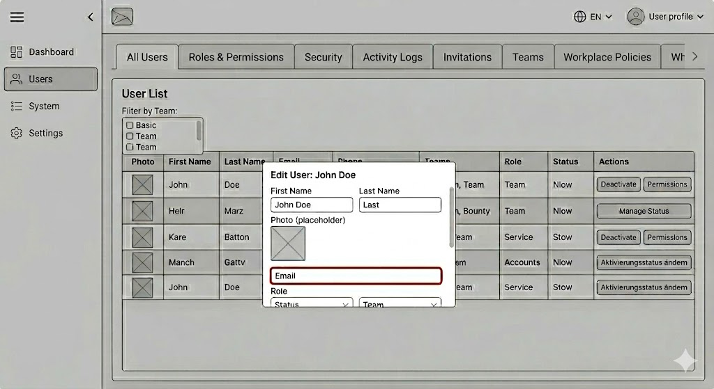

# Dash-Border - UserDashboard

An example dashboard for managing users with mocked data, limited functionality to the basic level of the prototype per the requirements.

## Generating mock data
Data generation was done with Faker.JS

```bash
npm run mock:generate
```

## Local server

Project points to a separate deployment of the mocked data, but you can run it as a local instance by running the local server

```bash
npm run server
```
or 

```bash
npm run mock
```

Will regenerate data and run the server. 

Note: If you count on local, you should uncomment line 23 and comment line 22 in "app/services/user.service.js"

## Development server

To start a local development server, run:

```bash
ng serve
```

If you go Local - `http://localhost:4200/`. 
Default will point you to the deployed service.
The application will automatically reload whenever you modify any of the source files.

## Deployment 

This is an automatically deployed app to Vercel. https://dash-border.vercel.app/ 
Service is located at https://restful-api-vercel-2pbh.onrender.com/

## Audit of the given wireframe




### Initial thoughts  

In general, if I receive such a wireframe, I would call it a raw, fast sketch generated from either a stronghold or a technically focused person or business. 
It contains the idea, but it's also a quick and dirty sketch with many minor patterns, which can be improved. 

### Action 

I'll start with the horizontal tabs and replace them with vertical ones, placed on the left. 
Avoiding horizontal tabs will make the implementation of responsive behavior easier. 
Avoiding horizontal tabs will also improve the scalability. 
I'll move the system and settings to the top right corner, where we can also add other tools for fine-tuning the Dash-Border. Like theme switch, notifications, etc.
Vertically placed tabs can give you a more convenient way to navigate through the main tabs (which I suppose will be the most common scenario, as they should be more often used, rather than the other system, settings, etc.)
Top right icon-based system-related buttons are less space-consuming that way.

### Filtering

I would prefer to have fewer visual controls for filtering, but more intuitive behavior in them. 
The filtering could be applied to all the top-level controls.
 - banners are clickable
 - drop-down behaves as expected
 - The search box, though, accepts any of the criteria. This way, we are unleashing more power for sorting from the keyboard.
 - Action buttons for user creation and those for editing and deleting are pulled to the right as the right-handed mode is most of the cases. 

## UI/UX Design

The redesigned dashboard introduces a remake of the wireframe with the above features implemented. Also:
 - a high-fidelity design
 - responsive behavior
 - basic accessibility
 - implementation of filtering 
 - functionality for adding, deleting, and editing a user

## AI Assistance

Angular was chosen as the last thing I achieved, with the latest versions of this framework. 
After a basic bootstrap, I used prompts to get the color theme, layout, and table. The dialog components skeleton was generated initially and then fine-tuned.
The same goes for the service responsible for fetching. Styles are almost AI-based on Material UI.
Mock server I did manually and mapped data too (using Faker.JS). I used Gemini Flash Preview on a free tier. 
